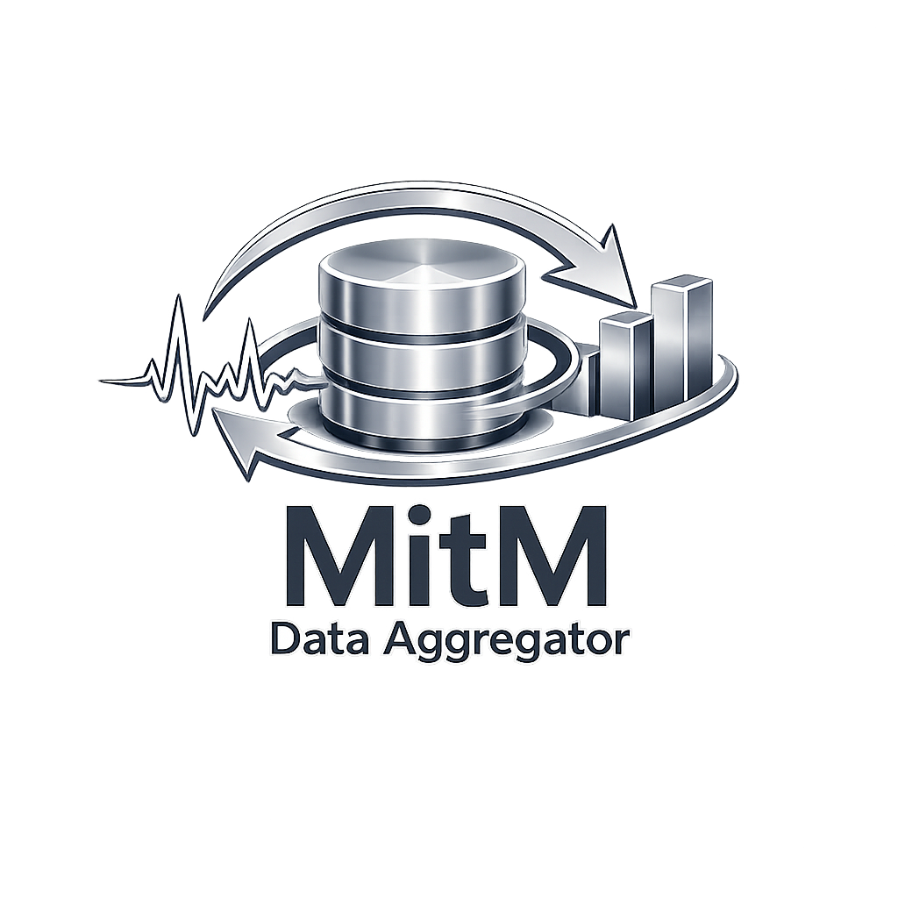
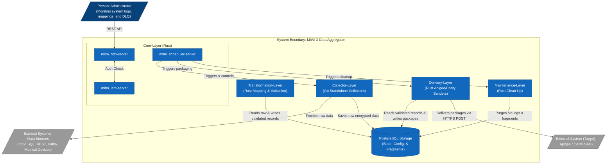

<p align="center">
  
</p>

# MitM-3 Data Aggregator

This repository contains the **MitM-3 Data Aggregator**, a secure middleware designed to reliably ingest data from heterogeneous on-premise systems, apply transformations, and securely deliver daily aggregated JSON packages to SaaS platforms (like Apigee or Cority).

## 🚀 Key Features

1. **Agentic SDD**: Utilizes SpecDD and GitHub Spec Kit (Flow-Forward workflow) for rigid architectural drift control.
2. **Envelope Encryption**: All sensitive data (PII) is encrypted at-rest using AES-GCM and a non-persisted Master Key (KEK) shared via IPC Unix Sockets.
3. **ABAC & IAM**: A dedicated Identity and Access Management server (`mitm_iam-server`) enforces OIDC/OAuth2 and Attribute-Based Access Control.
4. **Resilience & Statefulness**: Uses cursors for robust data ingestion and Dead Letter Queues (DLQ) for external delivery failure management.
5. **Hybrid Tech Stack**: Combines Rust 2024 for high-performance Core/Delivery layers and Go for dynamic Collector/Transformation layers.

---

## 🏗️ System & Component Context

The system consists of independent layers communicating via a PostgreSQL database and controlled by the Core Rust servers:



---

## 📂 Project Structure & Layers

### 1. Core Layer (Rust)

- **Role**: Contains `mitm_http-server` (Permanent API), `mitm_scheduler-server` (Orchestrator), and `mitm_iam-server` (AuthN/AuthZ).

### 2. Collector Layer (Go)

- **Role**: Autonomous collectors that connect to source systems, fetch raw data, apply initial AES-GCM envelope encryption, and insert them into the DB.

### 3. Transformation Layer (Rust)

- **Role**: Reads raw ingested records, decrypts them, applies mapping configurations, dynamic transformations, and validations, and writes target output fields to target tables. _(Maintained in branch `mitm-3_v2.xx`)_.

### 4. Delivery Layer (Rust)

- **Role**: Aggregates target records into daily JSON batches (`packages`), executes secure delivery with HTTP idempotency key headers, handles transient errors via exponential backoff. Separated into `mitm_apigee` and `mitm_cority`.

### 5. Admin Pane (C++/Web)

- **Role**: Desktop (Qt6/C++23) and Web (Angular 22) applications for managing configurations and monitoring logs.

### 6. Maintenance Layer (Rust)

- **Role**: Runs configurable clean-up jobs (`mitm_cleanup`) to purge old processed records according to strict data retention policies.

---

## 🔒 Security & Key Management

- **Envelope Encryption**: All Personally Identifiable Information (PII) data is encrypted at-rest.
- **Master Key (KEK)**: Cryptographically random key injected into `mitm_scheduler-server`. Exists **only in RAM** and is shared to isolated child processes via Unix Domain Sockets (IPC).
- **Data Encryption Key (DEK)**: Generated per fragment and stored inside the database, encrypted with the KEK.

---

## 🛠️ Build and Running Instructions

### 1. Prerequisites

- Rust 2024 Edition (`cargo`)
- Go 1.26+ (for Collectors)
- PostgreSQL Server

### 2. Compiling the Rust Components (Workspace)

```bash
cargo build --release
# Binaries will be available in target/release/
```

### 3. Compiling the Go Components

```bash
cd collector-layer/mitm_collector_pg
go build -o ../../target/release/mitm-collector-pg main.go
```

### 4. Running the Ecosystem

Set the `MASTER_KEY` environment variable (**only in your local machine, NOT in prod**) and start the core servers:

```bash
export MASTER_KEY="Y29uZmlkZW50aWFsX21hc3Rlcl9rZXlfMzJfYnl0ZXM="
./target/release/mitm-iam-server &
./target/release/mitm-http-server &
./target/release/mitm-scheduler-server &
```
