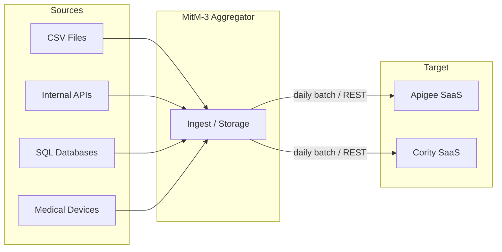
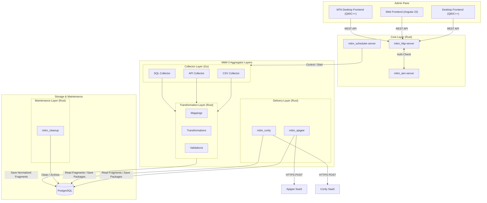
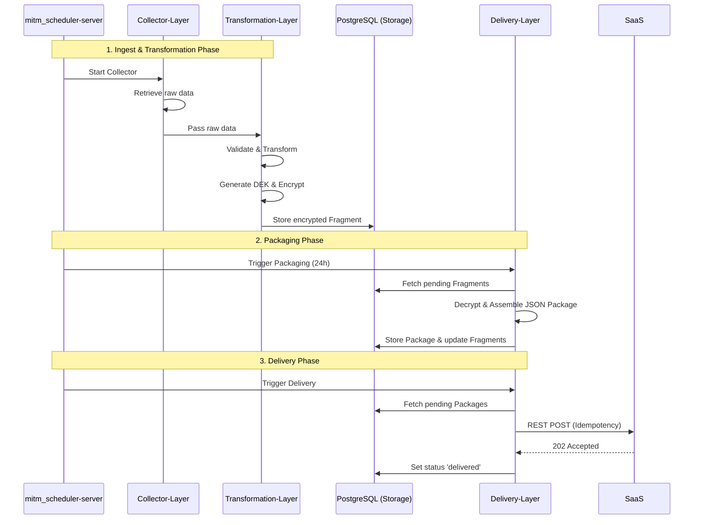
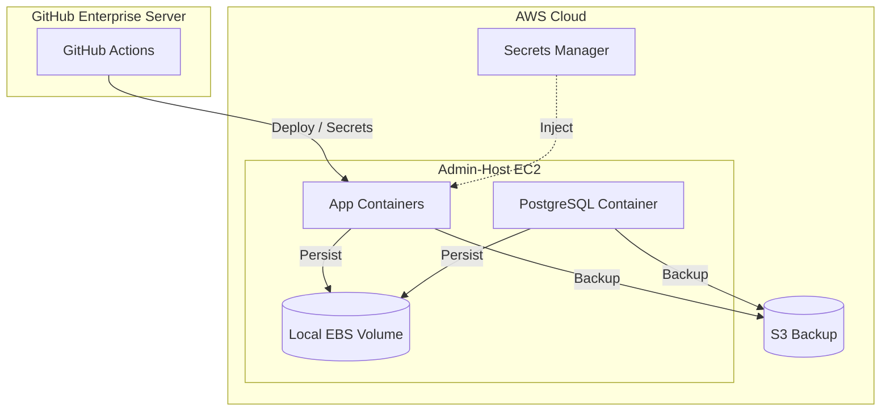
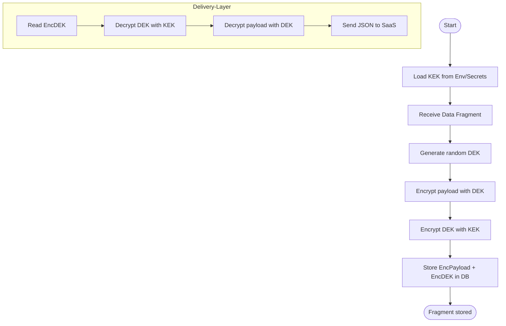

  

---
date: September 2026
title: "Architectural Concept: MitM-3 Data Aggregator"
---

# Architectural Concept: MitM-3 Data Aggregator

## Table of Contents

- [Architectural Concept: MitM-3 Data Aggregator](#architectural-concept-mitm-3-data-aggregator)
  - [Table of Contents](#table-of-contents)
- [1. Introduction and Goals](#1-introduction-and-goals)
  - [Task Description](#task-description)
  - [Quality Goals](#quality-goals)
  - [Stakeholders](#stakeholders)
- [2. Constraints](#2-constraints)
- [3. Context and Scope](#3-context-and-scope)
  - [Business Context](#business-context)
  - [Technical Context](#technical-context)
- [4. Solution Strategy](#4-solution-strategy)
- [5. Building Block View](#5-building-block-view)
  - [Whitebox Overall System](#whitebox-overall-system)
    - [Core-Layer (Control \& Auth)](#core-layer-control--auth)
    - [Admin Frontend (UI)](#admin-frontend-ui)
    - [Collector-Layer](#collector-layer)
    - [Transformation-Layer](#transformation-layer)
    - [Delivery-Layer](#delivery-layer)
    - [State \& Storage](#state--storage)
- [6. Runtime View](#6-runtime-view)
  - [Daily Workflow](#daily-workflow)
- [7. Deployment View](#7-deployment-view)
  - [Infrastructure Level 1](#infrastructure-level-1)
- [8. Cross-Cutting Concepts](#8-cross-cutting-concepts)
  - [Security \& Key Management](#security--key-management)
  - [Monitoring \& Diagnostics](#monitoring--diagnostics)
- [9. Architectural Decisions](#9-architectural-decisions)
- [10. Quality Requirements](#10-quality-requirements)
- [11. Risks and Technical Debt](#11-risks-and-technical-debt)
- [12. Artifacts](#12-artifacts)
  - [Security Flow Diagram](#security-flow-diagram)
- [13. Glossary](#13-glossary)

# 1. Introduction and Goals

## Task Description

Provision of a reliable, secure, and decoupled system (Man-in-the-Middle Aggregator) that collects data from various source systems (left), buffers it locally, aggregates it daily into JSON packages, and transmits it via REST to target SaaS platforms (right).

**Core Features:**

- Decoupling of sources and target.
- Daily packaged transmission.
- Full use of open-source components (MIT, Apache 2.0).
- Secure storage of personally identifiable information (PII) using Envelope Encryption.
- Agentic SDD (SpecDD & GitHub Spec Kit) for Flow-Forward architecture drift control.

## Quality Goals

| Goal | Description |
| :--- | :--- |
| **Security (Data Privacy)** | Protection of PII data "at-rest" using AES-GCM Envelope Encryption (KEK/DEK). |
| **Resilience** | Fault tolerance against failures of the SaaS or source systems using retries and cursors. |
| **Maintainability** | Modular design (Adapter pattern) for easy integration of new sources. |
| **Traceability** | Complete audit logging of security-relevant and process events. |

## Stakeholders

| Role | Expectation |
| :--- | :--- |
| **IT Architect** | Clean technological separation, compliance with security standards, SpecDD compliance. |
| **Security Officer** | Encryption of PII data, secure key handling (MasterKey is not persistent). ABAC data isolation. |
| **Operations Team (Admins)** | Simple deployment (containers), clear monitoring (Prometheus), logging (JSON). |
| **SaaS Provider** | Compliance with rate limits, correct JSON structures, idempotency. |

# 2. Constraints

- **Technology:** Rust 2024 as the primary language for Core, Delivery, and Maintenance layers. Go (Golang) remains for Collectors and Transformations. C++23/Qt6 for the Admin Frontend.
- **Data Storage:** PostgreSQL for state management and fragments (robust concurrency and scalability).
- **Platform:** AWS EC2 (Admin Host) with Docker, GitHub Enterprise Server (GHES) for CI/CD.
- **Licenses:** Open source only (MIT, Apache 2.0, etc.). No proprietary libraries.

# 3. Context and Scope

## Business Context

The system sits between any number of source systems (e.g., CSV exports, internal APIs, Medical Devices) and central SaaS platforms (e.g., Apigee, Cority). It acts as a buffer and aggregator.

## Technical Context

- **Source Interfaces:** Collector interface (polling/push) for CSV, REST, SQL, Kafka, MFT, Medical Devices, etc., implemented in the Go Collector-Layer.
- **Target Interfaces:** REST APIs (HTTPS) of the SaaS targets, implemented in the Rust Delivery-Layer.
- **Key Management:** Injection of the Master Key via environment (GHES Secrets / AWS Secrets Manager) securely passed via IPC sockets to sub-components.

# 4. Solution Strategy

- **Collector-Layer:** Encapsulation of source-specific collectors for easy extensibility in Go.
- **Asynchronous Processing:** Separation of collection, transformation, and delivery.
- **Envelope Encryption:** Each fragment is encrypted with an individual DEK; DEKs are stored encrypted with a KEK (MasterKey).
- **Stateful Polling:** Use of cursors to load only new data since the last run.
- **Core Splitting:** Separation of concerns in the Core Layer: HTTP API (`mitm_http-server`), Scheduling (`mitm_scheduler-server`), and Auth (`mitm_iam-server`).

# 5. Building Block View

## Whitebox Overall System

The system is structured into four main tiers: Admin Pane, Core-Layer, MitM-3 Aggregator Layers, and Storage & Maintenance.

### Admin Pane

Consists of three clients serving as the visual control plane for administrators to configure mappings, schedule jobs, and monitor logs:
- **Desktop Frontend:** A native Qt6/C++23 application (branch `mitm-3_v2.xx`).
- **Web Frontend:** A modern web application built with Angular 22.
- **MTA:** An additional MTA Desktop Frontend application built with Qt6/C++23.

### Core-Layer (Control & Auth)

Located in `core-layer/`. Consists of Rust 2024 applications:
- **mitm_http-server:** Exposes the REST API for the Admin Pane using domain-driven versioning.
- **mitm_scheduler-server:** Responsible for starting and orchestrating the collectors and triggering deliveries.
- **mitm_iam-server:** Manages Identity and Access (AuthN/AuthZ) providing OIDC/OAuth2, RBAC, and ABAC.

### MitM-3 Aggregator Layers

- **Collector-Layer (Go):** Consists of multiple Go-based collectors that utilize different data sources (CSV files, internal APIs, SQL databases, Medical Devices).
- **Transformation-Layer (Rust):** A Rust application responsible for executing Mappings, Transformations, and Validations on the fragments collected from source systems before they are securely persisted.
- **Delivery-Layer (Rust):** Located in `delivery-layer/`. Consists of Rust 2024 components (`mitm_apigee`, `mitm_cority`). Responsible for creating packages from the individual fragments and delivering them to their respective SaaS platforms.

### Storage & Maintenance

- **Persistence (PostgreSQL):** Manages cursors (progress), fragments (buffer), and packages (ready for delivery).
- **Maintenance-Layer (Rust):** Includes `mitm_cleanup` for scheduled archiving, pruning, and database cleanup batch jobs.

# 6. Runtime View

## Daily Workflow

# 7. Deployment View

## Infrastructure Level 1

# 8. Cross-Cutting Concepts

## Security & Key Management

- **Envelope Encryption:** KEK (MasterKey) resides only in RAM. DEKs are stored encrypted in the DB.
- **IPC Secrets Broker:** The Scheduler securely distributes the KEK and database credentials to isolated sub-processes exclusively via bidirectional Unix Domain Sockets (`.sock`). Environment variables are intentionally scrubbed to prevent leakage.
- **Atomic Operations:** All data ingestion and cursor progressions are guaranteed atomic using strict PostgreSQL transactions, ensuring robust at-least-once delivery semantics.
- **TLS & Identity:** HTTPS for all external calls. Internal administrative HTTP endpoints (`mitm_http-server`) enforce strict Authentication via JWT tokens provided by the `mitm_iam-server`.
- **ABAC/RBAC:** `mitm_iam-server` enforces fine-grained authorization (e.g., users can only see PII of their specific tenant).
- **Least Privilege:** Containers run as non-root users with restricted filesystem permissions.

## Monitoring & Diagnostics

- **Logging:** Structured JSON logging (stdout for Docker log drivers).
- **Metrics:** Prometheus exporter for fragment counters, package sizes, and API latencies.
- **Audit Log:** Immutable table in PostgreSQL for critical actions (admin access, key rotation).

# 9. Architectural Decisions

- **Hybrid Tech Stack (Rust/Go):** Transitioned to Rust 2024 for Core and Delivery layers to leverage its memory safety, concurrency, and performance while retaining Go for data parsing (Collectors) and transformations due to established stability.
- **PostgreSQL instead of SQLite:** Chosen to support high-concurrency environments, robust connection management, and better scalability, while ensuring transactional safety and reliability.
- **Stateless App / Stateful Storage:** The apps themselves can be restarted at any time; the entire state resides in the PostgreSQL database.
- **SpecDD Framework:** Architectural constraints and drift control are governed by SpecDD (`.sdd` files).

# 10. Quality Requirements

- **PII Protection:** 100% of personally identifiable information must be persisted in encrypted form using AES-GCM.
- **Data Loss Prevention:** Cursors prevent double ingestion or skipping of records.

# 11. Risks and Technical Debt

- **Database Size:** At extremely high volumes, an archiving or partitioning strategy for old fragments must be implemented (`mitm_cleanup` maintenance layer addresses this).
- **Key Loss:** Loss of the Master Key results in total data loss in the database (Mitigation: Backup of the key in a secure Vault).

# 12. Artifacts

## Security Flow Diagram

# 13. Glossary

| Term | Definition |
| :--- | :--- |
| **Fragment** | Smallest unit of data from a source (e.g., a row of a CSV). |
| **Package** | Aggregation of multiple fragments into a JSON document for SaaS delivery. |
| **KEK** | Key Encryption Key (Master Key). |
| **DEK** | Data Encryption Key (per fragment). |
| **DLQ** | Dead Letter Queue (storage for permanently failed records). |
| **ABAC** | Attribute-Based Access Control. |
